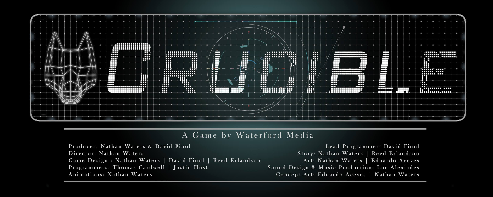

# Game Projects
The resume and LinkedIn links detail my work experience on enterprise web applications, but this portfolio website details the game projects I have pursued outside of a corporate structure.

## Card Game Simulator

[Website](https://cardgamesim.finoldigital.com)

My current project! I have spent the past half-year developing an extensible system of categorizing cards and playing them in a virtual space. CGS is available on Android/iOS. Please check out [https://cardgamesim.finoldigital.com](https://cardgamesim.finoldigital.com)!

## Crucible

[YouTube Trailer](https://youtu.be/4rTT_eflPGs)

[Source](https://github.com/davidmfinol/Crucible) 

Crucible is my first large-scale project. Originally titled "The Runners", this passion project turned out to be a bit of a crucible for myself and the co-lead. We spent over a year in active development on this project, even taking it into the Longhorn Startup program. As a mobile game, we developed a unique control system that allowed for stealth platforming using a combination of swiping on the screen. The AI for this game turned out to be the largest hurdle, as the core gameplay hinged on having enemy robots that were able to effectively traverse through 2D platforming in order to hunt down the player-character.

## Homebody
 

[Windowsx64 Executable ZIP](https://drive.google.com/uc?id=1ovrBIIe4bbCacYsrXTuk-tT-zBBLv2a3&export=download) 

[Source](https://github.com/davidmfinol/GGJ18) 

As one of the two programmers on this two day Global Game Jam project, I coded how the sound projectile moved and interacted with obstacles in game. I also handled the basic animations of the moving characters, and worked with the artists to ensure the level was laid out how they envisioned.

## Romskip Saga
 

[Windowsx64 Executable ZIP](https://drive.google.com/uc?id=12o87ILuhbaI6FuFteKO1Jt7vH8ZgbcnM&export=download)

[Source](https://github.com/davidmfinol/Spikings-A_Tale_Of_Space_Vikings)

This tale of space vikings comes from the final capstone course of the UT Game Development program. In this project, I worked with the artists and other programmers to layout the 2D assets in-game, with appropriate mechanics. In particular, I developed all the AI for the enemies in the game. I also played a large role in defining the actions the player character could take, such as climbing over platforms, and jumping off cliffs.

## GalactiCombat

[Windowsx86 Executable ZIP](https://drive.google.com/uc?id=1uWb3uhPq_-aKXi-P1tcbjS8I0dOGiUTU&export=download)

[Source](https://github.com/davidmfinol/GalactiCombat)

The first game project I worked on as part of the UT Game Development program. As part of a team of 3 programmers, I wrote all the code for movement, networking, and AI. The included README.pdf indicates all the instructions for linux machines, the original platform for this project. I have since ported it over to Windows, so now it needs to be run with GalactiCombat.exe.

## LIBnation

[Download ZIP](https://github.com/davidmfinol/LIBnationGame/archive/master.zip)

[Source](https://github.com/davidmfinol/LIBnationGame)

The first game I ever made. It doesn't get much simpler than this: 2 2D characters on a single plane, with basic movements, attack, and health. Originally created as a java applet to run in-browser, it has been updated to use JNLP, as applets have deprecated.

## Finullinator
 

[Executable JAR](https://github.com/davidmfinol/Finullinator/raw/master/Finullinator.jar) 

[Source](https://github.com/davidmfinol/Finullinator)

This incomplete project was my first attempt at creating my own game engine. There may not be much worth examining in this project, but it holds a special place in my heart.
