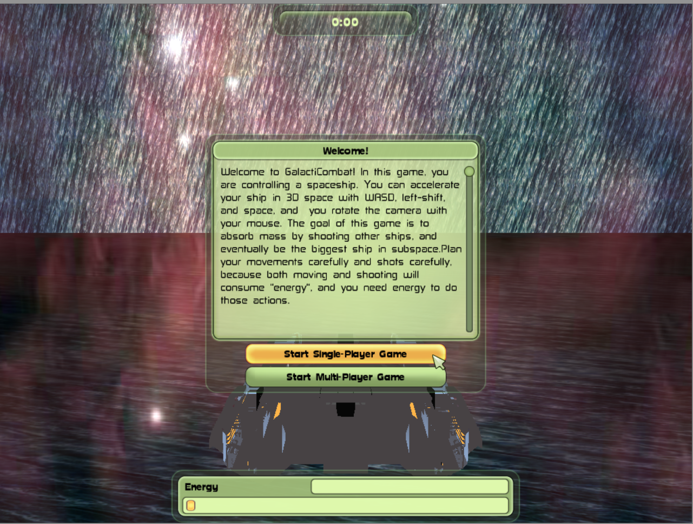

# Game Projects
The resume and LinkedIn links detail my work experience on enterprise web applications, but this portfolio website details the game projects I have pursued outside of a corporate structure.

## Card Game Simulator

## Crucible

## Homebody
 

[Website](https://globalgamejam.org/2018/games/homebody) 

[Source](https://github.com/davidmfinol/GGJ18) 

As one of the two programmers on this two day project, I coded how the sound projectile moved and interacted with obstacles in game. I also handled the basic animations of the moving characters, and worked with the artists to ensure the level was laid out how they envisioned.

## Romskip Saga

## GalactiCombat
 

[Windows Executable ZIP](https://github.com/davidmfinol/GalactiCombat)

[Source](https://github.com/davidmfinol/GalactiCombat)

The first game project I worked on as part of the UT Game Development program. As part of a 3 person team, I wrote all the code for movement, networking, and AI.

## LIBnation

[Download ZIP](https://github.com/davidmfinol/LIBnationGame/archive/master.zip)

[Source](https://github.com/davidmfinol/LIBnationGame)

The first game I ever made. It doesn't get much simpler than this: 2 2D characters on a single plane, with basic movements, attack, and health. Originally created as a java applet to run in-browser, it has been updated to use JNLP, as applets have deprecated.

## Finullinator
 

[Executable JAR](https://github.com/davidmfinol/Finullinator/raw/master/Finullinator.jar) 

[Source](https://github.com/davidmfinol/Finullinator)

This incomplete project was my first attempt at creating my own game engine. There may not be much worth examining in this project, but it holds a special place in my heart.
