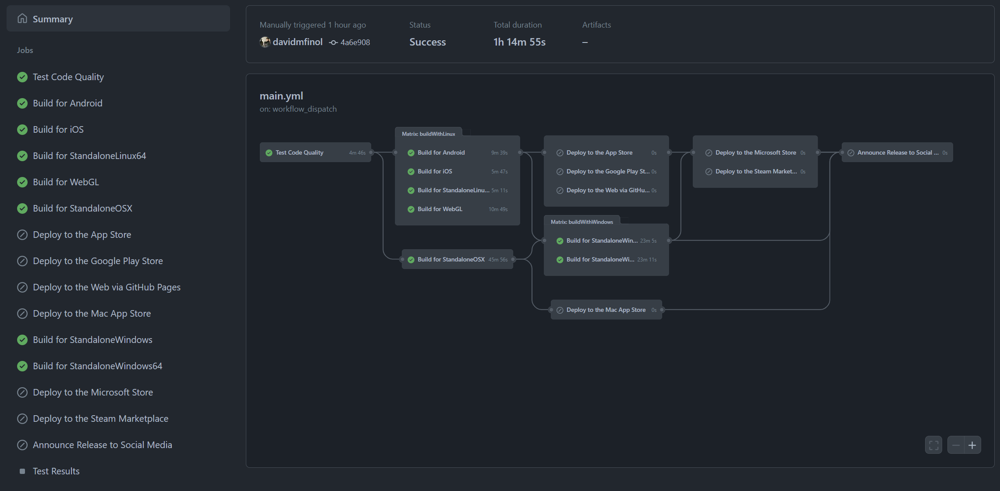

# GameCI 1: Intro to GitHub Actions for Unity

As a software engineer, I believe every modern software project should have a CI/CD pipeline.
The reasons for such are many and better explained [all](https://www.synopsys.com/glossary/what-is-cicd.html)
 [over](https://www.redhat.com/en/topics/devops/what-is-ci-cd) [the](https://www.infoworld.com/article/3271126/what-is-cicd-continuous-integration-and-continuous-delivery-explained.html)
 [internet](https://en.wikipedia.org/wiki/CI/CD), so I won't be making a case for why you should be using CI/CD.
Instead, I write this series of articles with the goal of helping Game Developers with their own pipelines.
In particular, I believe that [Unity](https://unity.com/) game projects don't have as many resources for CI/CD as they should.
Hopefully, this guide to how I built the CI/CD pipeline for my Unity project will help you with yours.

## My Workflow

A picture is worth a thousand words, so take a look at the visualization graph for my workflow:

Nowadays, developers have many CI options. Unity Cloud Build, CircleCI, GitLab CI, and Jenkins are just a few examples.
I chose [GitHub Actions](https://github.com/features/actions) because it is tightly integrated with the GitHub repository where I already keep my open-source project
 and GitHub provides free CI minutes for open-source projects.
Plus, it makes this nice visual graph.

## Pieces of the Workflow

You may have noticed that there are many different jobs in the workflow, where only some of them ran while others did not run.
Later I'll explain all the different jobs and what they do/how they work, but the first thing to examine is why some jobs run while others do not.
If you look at the names of the jobs that didn't run, you may be able to guess the reason: The jobs that deploy to production (the CD part of CI/CD) were not part of this workflow run.

Depending on how you think of it, it could be argued that my workflow is composed of multiple workflows.
For every push to my develop branch I run the test and build jobs, to confirm that new commits didn't break anything.
When I want to deploy to production, I [create a release](https://docs.github.com/en/repositories/releasing-projects-on-github/managing-releases-in-a-repository#creating-a-release) on GitHub. The release will trigger the workflow to run with the production deployment jobs.
I can also [manually run the workflow](https://docs.github.com/en/actions/managing-workflow-runs/manually-running-a-workflow), with the option to input which jobs should run.

The modularity of my workflow is enabled both by different triggers and by blocking certain jobs with conditions.
You may refer to the [complete workflow](https://github.com/finol-digital/Card-Game-Simulator/blob/develop/.github/workflows/main.yml) on GitHub, but going forward I will also excerpt the relevant code here.

## The Code

Let's get started with the first part of my workflow:



# .github/workflows/main.yml
name: Test, Build, and Deploy with GameCI
on:
  push:
    branches:
      - develop
    paths:
      - 'Assets/**'
      - 'Packages/**'
      - 'ProjectSettings/**'
  pull_request:
    types:
      - opened
    branches:
      - main
    paths:
      - 'Assets/**'
      - 'Packages/**'
      - 'ProjectSettings/**'
  release:
    types:
      - published
  workflow_dispatch:
    inputs:
      workflow_mode:
        description: '[release] [Android, iOS, StandaloneLinux64, WebGL, StandaloneWindows, StandaloneWindows64, WSAPlayer, StandaloneOSX, Steam]'
        required: false
        default: ''
jobs:



## Trigger On

As you can see, there are 4 triggers: `push` to develop, `pull_request` to main, `release` published (with a GitHub Release), and `workflow_dispatch`.

The `push` and `pull_request` triggers should run checks to validate each commit, along with a final validation before merging changes to `main`.
Runs on `push` and `pull_request` should only trigger if a file has changed in the actual Unity project, ie in `Assets/`, `Packages/`, or `ProjectSettings/`.
Any changes outside of these folders would not cause our Unity project to change, so they can be ignored.
For example, if we modify the README.md for our project, we wouldn't want the workflow to run, since it wouldn't actually be testing any relevant change to the Unity project.

Runs on `release` will trigger whenever a release is created in the GitHub UI, and we can use `if: github.event.action == 'published'` to detect this scenario.

The triggers for `workflow_dispatch` are the most interesting, since that's where we have setup the most control over the workflow.
For example, if we wanted to create 2 Windows .exe's to download and run, we can simply pass `StandaloneWindows StandaloneWindows64` as the input.
This would create both 32-bit and 64-bit Windows executables and upload them to GitHub, where they could then be downloaded for testing.

Taking it a step further, we could input `release Steam` to run the entire production deployment pipeline for Steam.
My Steam depots involve 4 artifacts: 1) Windows 32-bit, 2) Windows 64-bit, 3) Linux, and 4) Mac.
Building and deploying these artifacts is split across multiple jobs, so it would now be good to get a high-level overview of all the jobs.

## The Jobs

Going into detail on each job would make this article too long.
Furthermore, a reader who only wants to publish Android builds on Google Play would be interested in a different set of jobs than a reader who wants to publish PC games on Steam.
Therefore, here is a quick overview of each job, with links to more info, if more info is desired.
You may read these descriptions and then pick and choose to read only that which is relevant to you.

### Test Code Quality
I consider this job to be the most fundamental in any CI pipeline, as it is the one responsible for actually running your [unit tests](https://docs.unity3d.com/Manual/testing-editortestsrunner.html).
I also set up [SonarQube](https://www.sonarqube.org/) quality checks and do some release management.
See [GameCI 2: Testing](gameci-2_testing.html).

### Build with Linux
Builds the Android, iOS, StandaloneLinux64, and WebGL artifacts.
See [GameCI 3: Build with Linux](gameci-3_linuxbuild.html).

### Build with Mac
Builds the StandaloneOSX artifact and signs it to generate `Card Game Simulator.app`.
See [GameCI 5: Build and Deploy with Mac](gameci-5_mac.html).

### Deploy to the App Store
Takes the iOS artifact and uses fastlane to build and deploy to the App Store.
See [GameCI 5: Build and Deploy with Mac](gameci-5_mac.html).

### Deploy to the Google Play Store
Takes the Android artifact and uses fastlane to deploy it to the Google Play Store.
See [GameCI 4: Deploy with Linux](gameci-4_linuxdeploy.html).

### Deploy to the Web via GitHub Pages
Takes the WebGL artifact and deploys it via GitHub Pages.
See [GameCI 4: Deploy with Linux](gameci-4_linuxdeploy.html).

### Deploy to the Mac App Store
Takes the StandaloneOSX artifact and uses fastlane to deploy it to the Mac App Store.
See [GameCI 5: Build and Deploy with Mac](gameci-5_mac.html).

### Build with Windows
Builds the StandaloneWindows and StandaloneWindows64 artifacts.
See [GameCI 6: Build and Deploy with Windows](gameci-6_windows.html).

### Deploy to the Microsoft Store
Builds the WSAPlayer artifact and uses Microsoft's tools to build and deploy to the Microsoft Store.
See [GameCI 6: Build and Deploy with Windows](gameci-6_windows.html).

### Deploy to the Steam Marketplace
Takes the StandaloneWindows, StandaloneWindows64, StandaloneLinux64, and StandaloneOSX artifacts and deploys them to Steam.
See [GameCI 7: Conclusion](gameci-7_conclusion.html).

### Announce Release to Social Media
Posts to Discord and Twitter about the successful production deployment.
See [GameCI 7: Conclusion](gameci-7_conclusion.html).

## Continue

If you have decided that you would like to read about all the jobs in order, I'd recommend continuing with [GameCI 2: Testing](gameci-2_testing.html).
